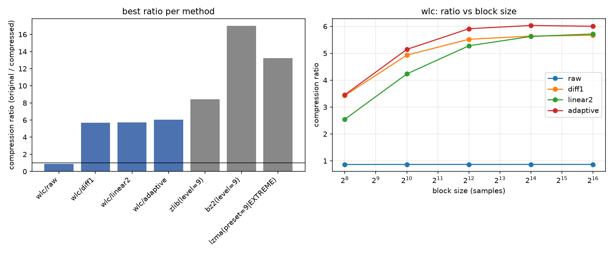

# 圧縮手法の比較レポート

対象データ: `data/wave_2026.dat`（uint8, 3,932,160 バイト）

## 手法

全体の流れは「予測残差への変換（ブロック単位、複数手法から選択可）→ 残差を Rice 符号でビット列に符号化」の2段階。実装は `src/wave_lossless_compression/predictors.py`（予測残差）、`rice.py`（Rice符号）、`codec.py`（ブロック分割・手法選択・全体の圧縮/復元）。すべての設定について、圧縮したデータを実際に復号して元データと完全に一致すること（可逆性）を確認済み。

### 予測残差変換（提案手法の入力側）

サンプル列 `x[0], x[1], ...`（各 uint8, 0-255）に対して、次の3種類の可逆変換を用意した。どれも「実際の値」と「予測値」の差（残差）を計算するだけで、残差から元の値を厳密に復元できる。

- **raw**: 予測を行わず `residual[i] = x[i]` とする。他手法との比較用のベースライン。
- **diff1**（1階差分）: 直前の1点から予測する。`residual[i] = x[i] - x[i-1]`（先頭のみ `residual[0] = x[0]`）。信号がゆっくり変化するほど残差が0付近に集中する。
- **linear2**（2点線形予測）: 直前2点の傾きをそのまま延長して予測する。`prediction[i] = 2*x[i-1] - x[i-2]`、`residual[i] = x[i] - prediction[i]`（先頭2点は `raw` と同じ）。信号が直線的に変化する区間では `diff1` より残差が小さくなりうるが、変化が急な区間ではかえって外れやすい。

### Rice符号（提案手法の符号化側）

残差は負の値も取りうるため、まず zigzag変換で符号なし整数に変換する（`0, -1, 1, -2, 2, ... → 0, 1, 2, 3, 4, ...`）。そのうえで、パラメータ `k` を1つ選び、各値 `v` を「商 `v >> k` を単進符号（1をq個並べて0で終端）」+「余り `v & (2^k - 1)` を固定長kビット」で表す。`k` が大きいほど固定長部分が増え、小さいほど単進符号部分が増えるため、値の大きさの分布に応じて最適な `k` が変わる。本実装ではブロックごとに、候補となる `k`（0〜16）それぞれで符号長`n*(k+1) + sum(v >> k)` を計算し、最小になる `k` を選んでいる（`rice.best_k`）。

### ブロック単位の適応選択（`wlc/adaptive`）

固定長ブロック（例: 4096サンプル）ごとに、`raw` / `diff1` / `linear2` それぞれで残差を計算し、各手法についてRice符号の最適な `k` と符号長を求め、符号長が最小になる（予測手法, k）の組をそのブロックの符号化方式として採用する。採用した予測手法（2bit）と `k`（6bit）は1ブロックあたり1バイトのメタデータとして別途保存し、復号時にどの手法を使ったブロックかを判別する。`wlc/raw` / `wlc/diff1` / `wlc/linear2` は、この選択を行わず全ブロックで同じ予測手法に固定した場合（比較用）。

各設定をブロックサイズ 256, 1024, 4096, 16384, 65536 サンプルで評価した。ブロックが小さいほど局所的な変化に追従しやすい一方、メタデータ（1ブロック1バイト）や `k` の再推定コストの相対的な割合が増える。

### 比較対象（汎用圧縮）

提案手法が「局所的な相関」をどこまで活かせているかを見るため、アルゴリズムの異なる汎用圧縮とも比較した（いずれも Python標準ライブラリ、レベル最大）。

- **zlib**（DEFLATE）: LZ77（直近32KB以内の繰り返し部分を過去への参照に置き換える）+ Huffman符号の組み合わせ。
- **bz2**: ブロックソート（BWT）で似た文脈の値を並び替えて集め、MTF・RLEを経てHuffman符号化する。ブロック内（デフォルト900KB）であれば離れた位置の繰り返しパターンもまとめて活かせる。
- **lzma**（xz形式）: LZ77を大きな辞書サイズ・高精度な範囲符号化（range coder）で拡張したもの。zlibよりも遠くの繰り返しを見つけやすい。

参考として、0次のシャノンエントロピー（隣接サンプル間の関係を使わず、値の出現頻度だけから求まる理論的な下限値。実際の符号化オーバーヘッドは含まない理想値）も併記した。

## 結果

### 提案手法（ブロック単位の予測選択 + Rice 符号）

| method | block_size | compressed bytes | ratio | bit/sample | encode(s) | decode(s) |
|---|---:|---:|---:|---:|---:|---:|
| wlc/raw | 256 | 4,541,878 | 0.866 | 9.240 | 0.69 | 0.72 |
| wlc/diff1 | 256 | 1,147,267 | 3.427 | 2.334 | 0.26 | 0.50 |
| wlc/linear2 | 256 | 1,544,935 | 2.545 | 3.143 | 0.46 | 1.31 |
| wlc/adaptive | 256 | 1,138,160 | 3.455 | 2.316 | 0.69 | 0.55 |
| wlc/raw | 1024 | 4,530,364 | 0.868 | 9.217 | 0.43 | 0.77 |
| wlc/diff1 | 1024 | 797,519 | 4.930 | 1.623 | 0.10 | 0.46 |
| wlc/linear2 | 1024 | 929,106 | 4.232 | 1.890 | 0.10 | 1.13 |
| wlc/adaptive | 1024 | 764,357 | 5.144 | 1.555 | 0.20 | 0.50 |
| wlc/raw | 4096 | 4,527,485 | 0.869 | 9.211 | 0.36 | 0.70 |
| wlc/diff1 | 4096 | 712,309 | 5.520 | 1.449 | 0.06 | 0.42 |
| wlc/linear2 | 4096 | 745,073 | 5.278 | 1.516 | 0.06 | 1.16 |
| wlc/adaptive | 4096 | 665,061 | 5.912 | 1.353 | 0.09 | 0.51 |
| wlc/raw | 16384 | 4,526,765 | 0.869 | 9.210 | 0.28 | 0.68 |
| wlc/diff1 | 16384 | 697,367 | 5.639 | 1.419 | 0.04 | 0.40 |
| wlc/linear2 | 16384 | 699,126 | 5.624 | 1.422 | 0.04 | 1.12 |
| wlc/adaptive | 16384 | 651,733 | 6.033 | 1.326 | 0.07 | 0.57 |
| wlc/raw | 65536 | 4,526,585 | 0.869 | 9.209 | 0.27 | 0.68 |
| wlc/diff1 | 65536 | 693,655 | 5.669 | 1.411 | 0.04 | 0.39 |
| wlc/linear2 | 65536 | 687,695 | 5.718 | 1.399 | 0.04 | 1.12 |
| wlc/adaptive | 65536 | 654,866 | 6.005 | 1.332 | 0.07 | 0.63 |

### 汎用圧縮との比較

| method | compressed bytes | ratio | bit/sample |
|---|---:|---:|---:|
| zlib(level=9) | 466,068 | 8.437 | 0.948 |
| bz2(level=9) | 231,249 | 17.004 | 0.470 |
| lzma(preset=9|EXTREME) | 297,536 | 13.216 | 0.605 |

### 理論的な下限（0次エントロピー、ブロック分割なし）

| method | bit/sample | 理論上のratio |
|---|---:|---:|
| entropy(raw) | 3.935 | 2.033 |
| entropy(diff1) | 1.120 | 7.145 |
| entropy(linear2) | 1.093 | 7.319 |

## わかったこと

- 提案手法（予測 + Rice符号）の中で最も良かったのは **wlc/adaptive**（block_size=16384）で、圧縮率 6.03 倍（1.326 bit/sample）。全体の最良は汎用圧縮の **bz2(level=9)**（17.00 倍）で、提案手法は汎用圧縮（特に bz2, lzma）に明確に及ばなかった。
- `raw` 予測（差分を取らない）はほぼ効果がなく、むしろ元データより大きくなる（ratio<1）。生波形の値は126付近を中心にばらついており、0次エントロピーだけでも3.93 bit/sample かかる。`diff1`・`linear2` に切り替えるだけでエントロピーが約3.5倍改善しており、隣接サンプル間の相関が非常に強いことがわかる。
- ブロックごとに予測手法を適応選択する `wlc/adaptive` は、固定手法よりわずかに改善するにとどまった。ブロックサイズが小さいほど適応の余地は大きくなるが、メタデータ（1ブロックあたり1バイト）や Rice パラメータの再推定コストも増えるため、小さすぎるブロックサイズではかえって不利になる。
- 提案手法の実測値（bit/sample）は、対応する0次エントロピーの理論下限にかなり近い値まで達している。つまり **Rice符号自体の効率は妥当** であり、汎用圧縮に負けている原因は符号化方式ではなく、予測モデルが捉えている相関の射程がサンプル1〜2個分の局所的な相関に限られている点にある。
- 波形分析（README参照）では600-1000Hz付近に強い周期成分があるとわかっている。これは65536Hzサンプリングで周期にして65〜109サンプル程度に相当し、似た波形が周期的に繰り返される。bz2やlzmaはこうした長距離の繰り返しパターンを（それぞれBWT/LZ77系のマッチングで）利用できるが、`diff1`/`linear2` のような直近1〜2点だけを見る予測器はこの周期的な繰り返しを捉えられない。これが汎用圧縮に及ばない主な理由と考えられる。

## 今後の改善案

- 周期成分を利用するため、固定オフセット（推定周期分前のサンプル）を予測に使う「長期予測（long-term prediction）」をブロックごとの候補に追加する。
- Rice符号のパラメータ推定を、ブロック単位ではなくよりきめ細かく（あるいは適応的に）行う、またはコンテキストモデリングを導入する。
- 可変長ブロック分割（動的計画法によるブロック境界の最適化）を検討し、予測が効きやすい区間とそうでない区間を切り分ける。
