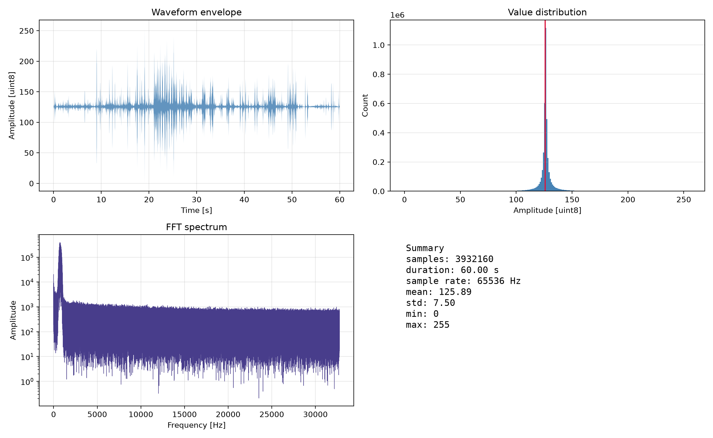
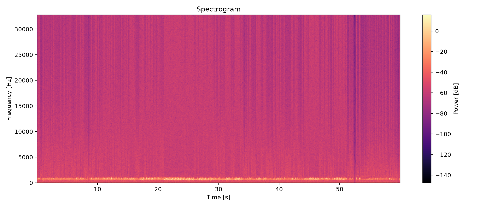
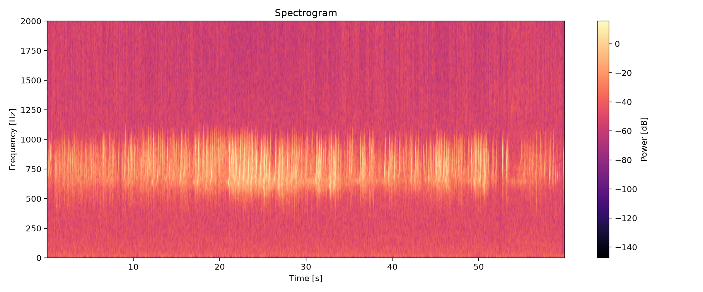
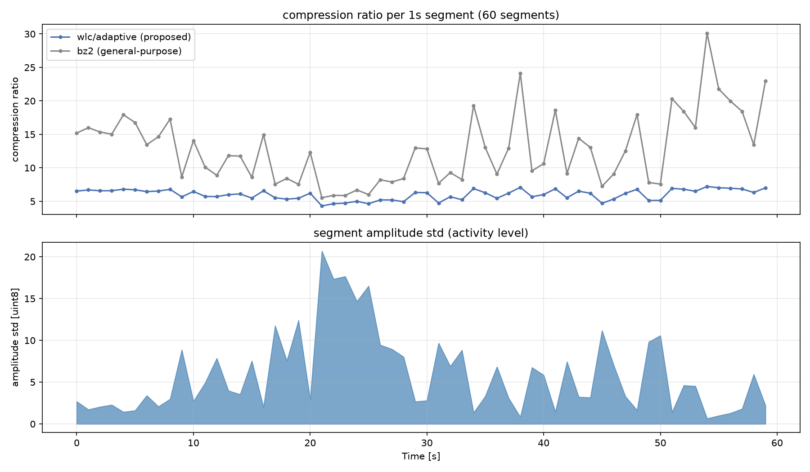

# 異分野研究探査 （通信情報工学研究室）レポート

氏名: 吉岡智輝

学籍番号: 2615131067

## 研究課題の概要

宇宙で観測された波形データを、衛星ー地上間で通信容量が限られているということを考慮して、可逆圧縮することを目的とする。対象データは、あらせ衛星のプラズマ波動実験で取得された自然電磁波の波形データである。
データの仕様は以下の通りである。

- サンプリングレート: 65536 Hz
- 量子化ビット数: 8 bit
- 継続秒数: 60 s
- 記録形式: バイナリフォーマット
- ファイルサイズ: 3,932,160 bytes

## 調査の目的・目標

本調査では、以下の3つの要件を満たすことを目的とする。ß
1. 周波数-時間ダイヤグラム（スペクトログラム）による可視化と特徴調査
2. 独自実装による可逆圧縮アルゴリズムと、可逆性を確認する方法の実装
3. 時間区間ごとの圧縮と、圧縮率の時間推移の評価

## 調査の方法

Python（numpy, matplotlib）で実装し周波数が時間とともにどう変わるかを見るため、matplotlibのspecgram関数でスペクトログラムを作成した。

可逆圧縮は、既存の圧縮ライブラリを使わず、「予測残差への変換」と「Rice符号」の2段階で自作した。予測は raw（そのまま）、diff1（1つ前との差分）、linear2（直前2点からの線形予測）の3種類を用意し、ブロックごとに一番圧縮できる予測手法とRice符号のパラメータkを選ぶようにした。

可逆性は、pytestで各変換をdecode(encode(x))==xで確認したほか、実データを圧縮・複号してnp.array_equalで一致するかも確認した。

評価は、ブロックサイズと予測手法を変えて圧縮率を比較した。さらに60秒のデータを1秒ごとに区切り、区間ごとの圧縮率の変化も調べた。

## 実施内容

<!-- 実際に何を行ったかを、得られた図・数値を示しながら記述する -->

### 1. 波形データの基本的な特徴

<!-- 平均125.89, 標準偏差7.50, 値域0-255。0次エントロピー3.93 bit/sample など -->

*図1: 波形の概要（波形エンベロープ／振幅ヒストグラム／FFTスペクトル／基本統計量）*

値の分布については、平均125.89、標準偏差7.50、最小値0、最大値255であった。
分布をみると、とくに100-150付近に多くのサンプルが集中しており、平均値を軸に左右対象な分布ろしている。またFFTスペクトルをみると、500-1000Hz付近にピークがあることがわかる。

### 2. 周波数-時間ダイヤグラムによる可視化

<!-- 600-1000Hz帯が常時存在／20-26秒・45-50秒付近でバースト的に強度増大、など -->

*図2: スペクトログラム(0-32768 Hz)。*

サンプリング定理より今回のデータで見られる周波数の上限は32768 Hzであるのでそれを最大値に設定したが、実際には500-1000Hz付近にピークがあるため、見やすいように0-2 kHzに拡大したスペクトログラムも作成した。図3に示す。

*図3: スペクトログラム（0–2 kHz に拡大）*

上記したが、時間帯に関係なく、500-1000Hz帯の信号が常時存在していることがわかる。また、20-35秒付近は特に、500-1000Hz帯の信号が強いことがわかる。

### 3. 可逆圧縮アルゴリズムの実装と可逆性の確認

<!-- テストが全てpassすること、評価スクリプトでの往復検証結果に触れる -->

### 4. 圧縮率の評価（データ全体）

<!-- 表・グラフを見ながら、どの設定が最良だったかを記述 -->

*表1: 提案手法（予測+Rice符号）の圧縮率（抜粋。全データは results/compression_evaluation/results.csv）*

| method | block_size | 圧縮後バイト数 | 圧縮率 | bit/sample |
|---|---:|---:|---:|---:|
| wlc/raw | 65536 | 4,526,585 | 0.869 | 9.209 |
| wlc/diff1 | 65536 | 693,655 | 5.669 | 1.411 |
| wlc/linear2 | 65536 | 687,695 | 5.718 | 1.399 |
| wlc/adaptive | 16384 | 651,733 | 6.033 | 1.326 |

*表2: 汎用圧縮・理論的下限との比較*

| method | 圧縮率 | bit/sample |
|---|---:|---:|
| zlib (level=9) | 8.437 | 0.948 |
| bz2 (level=9) | 17.004 | 0.470 |
| lzma (preset=9\|EXTREME) | 13.216 | 0.605 |
| entropy(diff1) 理論下限 | 7.145 | 1.120 |
| entropy(linear2) 理論下限 | 7.319 | 1.093 |

*図4: 手法ごとの圧縮率比較（左：最良圧縮率、右：ブロックサイズ依存性）*

### 5. 圧縮率の時間推移の評価

<!-- 1秒×60区間での圧縮率の変化、活動度(std)との相関(-0.91)などを記述 -->

*図4: 上段：1秒区間ごとの圧縮率の時間推移（提案手法 vs bz2）。下段：区間ごとの振幅標準偏差。*

<!-- 元データ: results/time_segment_evaluation/time_segments.csv -->

## 得られた成果と考察

<!--
書き込みたいポイント例（数値の裏取りはresults.csv等を参照）:
- raw予測はほぼ無効。diff1で切替えるだけでエントロピーが大幅改善→隣接相関が強い
- adaptive選択は固定手法よりわずかな改善にとどまる。ブロックが小さすぎるとメタデータ増でむしろ不利
- 提案手法のbit/sampleは0次エントロピー理論下限にかなり近い→Rice符号自体は妥当、
  劣っているのは予測モデルの射程(直近1-2点)の問題
- bz2/lzmaに大きく劣る(6.03倍 vs 17.0倍)理由: 600-1000Hz周期成分(周期約65-109サンプル)のような
  長距離の繰り返しを直近1-2点しか見ない予測器では捉えられない
- 時間推移: 活動度(std)と圧縮率の相関-0.91。バースト区間(スペクトログラムで見た20-26秒等)で
  圧縮率が悪化することが定量的に裏付けられた
-->

## 結論・残された課題

<!--
- 3要件（可視化・独自実装可逆圧縮・時間推移評価）を満たしたことの総括
- 提案手法の圧縮率(6.03倍)と汎用圧縮(bz2 17.0倍)の差、その主因の結論
- 今後の改善案:
  - 周期成分を使う長期予測(long-term prediction)の追加
  - 可変長ブロック分割(動的計画法)
  - より高度なエントロピー符号化(コンテキストモデリング/算術符号化)
  - 活動度に応じた符号化パラメータの動的切替
-->
