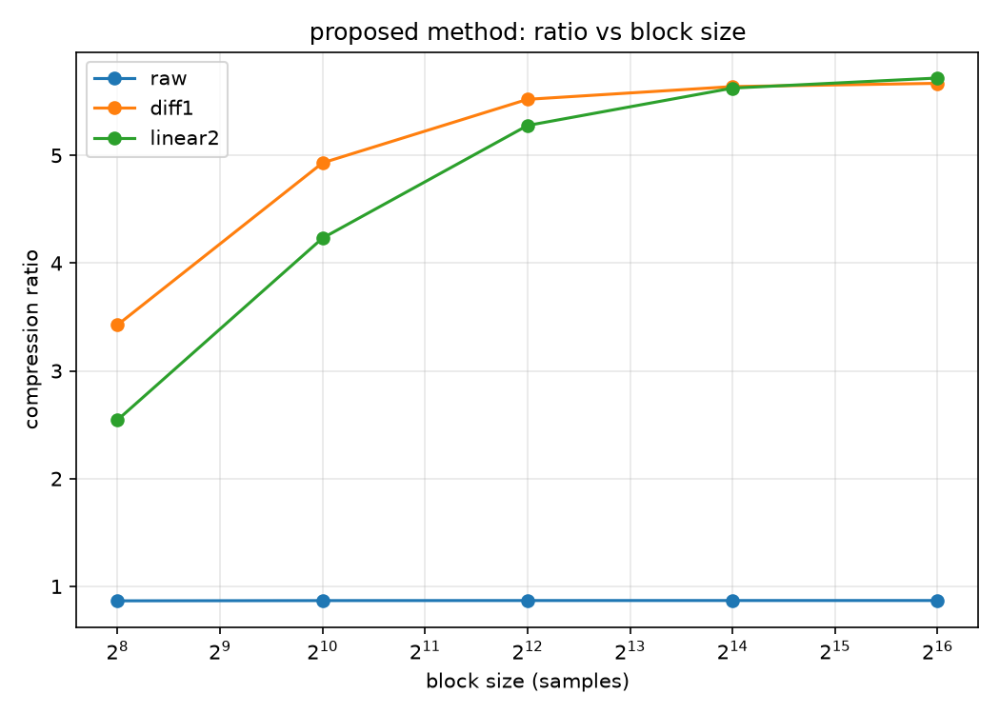

# 異分野研究探査 （通信情報工学研究室）レポート

氏名: 吉岡智輝

学籍番号: 2615131067

## 研究課題の概要

宇宙で観測された波形データを、衛星ー地上間で通信容量が限られているということを考慮して、可逆圧縮することを目的とする。対象データは、あらせ衛星のプラズマ波動実験で取得された自然電磁波の波形データである。
データの仕様は以下の通りである。

- サンプリングレート: 65536 Hz
- 量子化ビット数: 8 bit
- 継続秒数: 60 s
- 記録形式: バイナリフォーマット
- ファイルサイズ: 3,932,160 bytes

## 調査の目的・目標

本調査では、以下の3つの要件を満たすことを目的とする。ß
1. 周波数-時間ダイヤグラム（スペクトログラム）による可視化と特徴調査
2. 独自実装による可逆圧縮アルゴリズムと、可逆性を確認する方法の実装
3. 時間区間ごとの圧縮と、圧縮率の時間推移の評価

## 調査の方法

Python（numpy, matplotlib）で実装し周波数が時間とともにどう変わるかを見るため、matplotlibでスペクトログラムを作成した。

可逆圧縮は、既存の圧縮ライブラリを使わず、「予測残差への変換」と「Rice符号」の2段階で自作した。予測は raw（そのまま）、diff1（1つ前との差分）、linear2（直前2点からの線形予測）の3種類を用意し、ブロックごとに一番圧縮できる予測手法とRice符号のパラメータkを選ぶようにした。具体的な数式を以下に示す（$x_i$がi番目のサンプル、$r_i$がその予測残差）。

**diff1**

$$ r_i = x_i - x_{i-1} \tag{1} $$

**linear2**

$$ r_i = x_i - (2x_{i-1} - x_{i-2}) \tag{2} $$

実際の値ではなく、この予測残差の方を圧縮対象のデータとして持つ。信号がゆっくり変化する区間では予測が当たりやすく、residualが0付近に集中するため、少ないビット数で表現できる。

可逆性は、pytestで各変換をdecode(encode(x))==xで確認したほか、実データを圧縮・複号してnp.array_equalで一致するかも確認した。

評価は、ブロックサイズと予測手法を変えて圧縮率を比較した。さらに60秒のデータを1秒ごとに区切り、区間ごとの圧縮率の変化も調べた。

## 実施内容

<!-- 実際に何を行ったかを、得られた図・数値を示しながら記述する -->

### 1. 波形データの基本的な特徴

<!-- 平均125.89, 標準偏差7.50, 値域0-255。0次エントロピー3.93 bit/sample など -->

*図1: 波形の概要（波形エンベロープ／振幅ヒストグラム／FFTスペクトル／基本統計量）*

値の分布については、平均125.89、標準偏差7.50、最小値0、最大値255であった。
分布をみると、とくに100-150付近に多くのサンプルが集中しており、平均値を軸に左右対象な分布ろしている。またFFTスペクトルをみると、500-1000Hz付近にピークがあることがわかる。

### 2. 周波数-時間ダイヤグラムによる可視化

<!-- 600-1000Hz帯が常時存在／20-26秒・45-50秒付近でバースト的に強度増大、など -->

*図2: スペクトログラム(0-32768 Hz)。*

サンプリング定理より今回のデータで見られる周波数の上限は32768 Hzであるのでそれを最大値に設定したが、実際には500-1000Hz付近にピークがあるため、見やすいように0-2 kHzに拡大したスペクトログラムも作成した。図3に示す。

*図3: スペクトログラム（0–2 kHz に拡大）*

上記したが、時間帯に関係なく、500-1000Hz帯の信号が常時存在していることがわかる。また、20-35秒付近は特に、500-1000Hz帯の信号が強いことがわかる。

### 3. 可逆圧縮アルゴリズムの実装と可逆性の確認

調査の方法で述べた通り、予測残差への変換とRice符号を組み合わせた圧縮プログラムを実装した。予測はraw・diff1・linear2の3種類を用意し、ブロックごとに一番圧縮率がよくなる予測手法とRice符号のパラメータkを自動で選ぶようにしてある。

可逆性については、pytestで空の配列や要素数1個などの境界の値を含めて確認したほか、wave_2026.dat全体を実際に圧縮・複号し、元のデータと1バイトも違わず一致することを確認した。ブロックサイズや予測手法の組み合わせを変えても、すべて元のデータに戻ることを確認できている。

### 4. 圧縮率の評価

圧縮した結果は表1の通りである。

*表1: データ全体をそのまま圧縮した結果*

| method | 圧縮後バイト数 | 圧縮率 | bit/sample |
|---|---:|---:|---:|
| raw | 4,526,526 | 0.869 | 9.209 |
| diff1 | 692,669 | 5.677 | 1.409 |
| linear2 | 683,903 | 5.750 | 1.391 |

一番圧縮率が良かったのはlinear2で、5.75倍だった。

補足実験として、ブロックサイズを256サンプルから65536サンプルまで変えて、圧縮率がどう変わるかも調べた。結果を図4に示す。

*図4: ブロックサイズごとの圧縮率（予測手法別、補足実験）*

### 5. 圧縮率の時間推移の評価

60秒のデータを1秒ごとに60個の区間に分け、区間ごとに圧縮率を求めた結果が図5である。

*図5: 1秒区間ごとの圧縮率の時間推移*

rawはどの区間でも1倍を下回っており、時間帯によらず一貫して圧縮に向いていない。diff1・linear2は区間によって圧縮率が上下しており、特にdiff1はどの区間でも常にlinear2より良い結果になっている。図2・図3のスペクトログラムで信号が強く見えていた20〜35秒付近は、この図5でも圧縮率が落ち込んでいる。

## 得られた成果と考察

diff1に変えるだけで圧縮率は5倍以上になっており、隣り合うサンプルの値が近いという性質が圧縮に効いていることがわかる。

ブロックサイズを変えて評価したのは、「信号の性質は場所によって違うはずだから、Rice符号のパラメータkもブロックごとに局所的に最適化した方が効率的なはず」という仮説があったためである。しかし表1を見ると、diff1・linear2ともブロックサイズを大きくするほど圧縮率が上がっており、仮説とは逆の結果になった。これは、ブロックを細かくするほど予測手法とkを記録するメタデータ（1ブロックあたり1バイト）の割合が相対的に重くなり、局所適応で得られる分を上回ってしまうためと考えられる。なお、5節の時間区間ごとの評価をみると信号の暴れ方自体は時間によって大きく変化しているため、「局所的な性質の違いがある」という前提自体は正しいと考えられ、メタデータのコストをもっと小さくできれば局所適応が効いてくる可能性もある。

スペクトログラムで見た500-1000Hz付近の信号は、周期にすると数十サンプル分の繰り返しになる。diff1やlinear2は直前1〜2個のサンプルしか見ていないため、このような少し離れた繰り返しはまだ活かしきれておらず、圧縮率をさらに上げる余地があると考えられる。

時間区間ごとの評価からは、信号が活発な区間ほど圧縮率が下がることが分かった。これはスペクトログラムで信号が強く見えていた時間帯と一致しており、振幅の変動が大きくなると予測が外れやすくなり、残差が大きくなるためだと考えられる。

## 結論・残された課題

今回、周波数-時間ダイヤグラムによる可視化、独自の可逆圧縮アルゴリズムの実装と可逆性の確認、時間区間ごとの圧縮率の評価という3つの要件に取り組んだ。実装した圧縮アルゴリズムは最大で5.75倍の圧縮率を達成し、可逆であることも確認できた。一方で、直前のサンプルしか見ない予測手法では限界があることも分かった。

残された課題としては、今回はブロックごとに予測手法を固定して比較したが、ブロックごとに一番圧縮できる予測手法を選び、どの手法を使ったかをビットとして一緒に保持しておく方法も試す価値がある。
